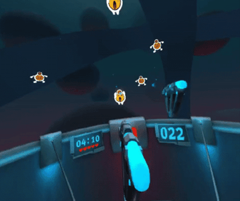

# A-Blast

A WebVR FPS mini-game demo using  [Mozilla VR](http://mozvr.com).
<p align="center">
  
</p>

## Local Development

```bash
git clone git@github.com:aframevr/a-blast && cd a-blast
npm install
npm start
```
Then, load [`http://localhost:8080`](http://localhost:8080) in your browser
## This game is heavily modified to meet some of the collision requirements and other environment variables 

**ORIGINAL BASE CODE REPOSITORY **
https://github.com/aframevr/a-blast/blob/master

## Working on 3D model converter to 2D converter will put up the repo link soon 
